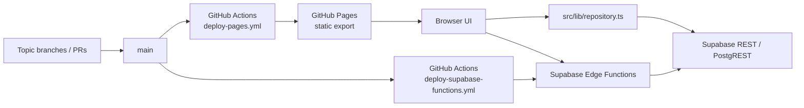

# Architecture

## System Model

World Toto Lab は、GitHub Pages 上で配信する static export フロントエンドと、Supabase を共有データストアにした MVP です。



## Core Constraints

- Next.js 16 App Router
- `src/app` 配下の static route を `next build` で export
- [next.config.ts](../next.config.ts) で `output: "export"` と `trailingSlash: true`
- Pages project site 用の `basePath` / `assetPrefix` を build 時に決定
- 動的 path ではなく query param で context を渡す
- today の deploy trigger は `main` push
- recommended workflow は `branch -> PR -> main merge`

## Repository Layout

| 場所 | 役割 |
| --- | --- |
| `src/app` | App Router の page 群。各 route は `page.tsx` で定義 |
| `src/components` | UI コンポーネントと画面断片 |
| `src/lib` | repository、型、集計、route helper、入出力ロジック |
| `public` | static asset |
| `scripts` | schema / Pages / Supabase の確認スクリプト |
| `supabase` | `schema.sql`、Edge Functions、hotfix SQL |
| `docs` | 開発運用、設計、監査メモ |
| `.github` | Pages deploy、Supabase Functions deploy、Issue / PR template |

## Route Model

現行 route はすべて top-level static path です。  
Pages 配信時の実 URL には repo 名の `basePath` が付きます。

主要 route:

- Dashboard: `/`
- Workspace: `/workspace`
- 共有入力: `/simple-view`, `/pick-room`, `/play`, `/picks`, `/scout-cards`
- 分析: `/consensus`, `/edge-board`, `/ticket-generator`, `/review`, `/winner-value`, `/goal3-value`, `/big-carryover`
- 練習 / 運用: `/practice-lab`, `/dev-playbook`
- 編集 / 取り込み: `/match-editor`, `/official-schedule-import`, `/fixture-selector`, `/toto-official-round-import`

context の受け渡し:

- Round: `?round=<id>`
- User: `?user=<id>`
- Match: `?match=<id>`

route helper は [src/lib/round-links.ts](../src/lib/round-links.ts) に集約されています。

- `appRoute`
- `buildHref`
- `buildRoundHref`
- `buildOfficialRoundImportHref`

`/workspace/<roundId>` のような dynamic path は現行設計では不採用です。

## Runtime Data Flow

1. `src/app/**/page.tsx` が route を描画する
2. `src/components/**` と `src/lib/**` が画面ロジックを組み立てる
3. [src/lib/repository.ts](../src/lib/repository.ts) が Supabase を読む / 書く
4. 必要に応じて Edge Functions を呼ぶ
5. UI が query param と取得データをもとに表示を切り替える

影響範囲が広い中心ファイル:

- `src/lib/repository.ts`
- `src/lib/types.ts`
- `src/lib/round-links.ts`
- `src/app/layout.tsx`
- `next.config.ts`

## Mode Model

Round には `productType` に加えて、使い方と材料の厚みを示す mode 系フィールドを持たせています。

- `competitionType`
  - `world_cup`
  - `domestic_toto`
  - `winner`
  - `custom`
- `sportContext`
  - `national_team`
  - `j_league`
  - `club`
  - `other`
- `primaryUse`
  - `real_round_research`
  - `practice`
  - `demo`
  - `friend_game`
- `dataProfile`
  - `worldcup_rich`
  - `domestic_standard`
  - `manual_light`
  - `demo`
- `probabilityReadiness`
  - `ready`
  - `partial`
  - `low_confidence`
  - `not_ready`

設計意図は「W杯totoを主役にしつつ、通常totoを練習回として同じロジックで回す」ことです。

## WorldCup Mode

W杯モードでは、次の材料を重視します。

- FIFA公式日程
- グループ / ステージ
- 代表チーム文脈
- 予測市場 / bookmaker 市場確率
- 怪我 / 招集ニュース
- 移動 / 気候 / 会場
- グループリーグ勝点状況
- Human Scout Card
- toto公式投票率

W杯は材料が厚いので、`dataProfile = worldcup_rich` と `probabilityReadiness = ready/partial` へ行きやすい前提です。

## Domestic Toto Mode

通常totoモードでは、次の材料を重視します。

- toto公式対象試合
- Jリーグ日程
- ホーム / アウェイ
- 直近成績
- 順位 / 勝点 / モチベーション
- 怪我 / 出場停止
- 休養日数 / 移動距離
- 市場確率があれば入力
- Human Scout Card
- toto公式投票率

通常totoは W杯ほど外部市場が厚くないことがあるため、`Research Memo` と手入力補正が重要です。

## Common Probability Engine

W杯でも通常totoでも、共通の probability engine を使います。

- 実装: [src/lib/probability/engine.ts](../src/lib/probability/engine.ts)
- 入口: `calculateModelProbabilities(match, context)`

基本方針:

1. `marketProb` があれば、それを base にする
2. なければ competition ごとの fallback prior を使う
3. Human Scout Card の `F / D` を補正として加える
4. W杯 / 通常totoごとの手入力補正を加える
5. `officialVote` は原則モデルへ混ぜない
6. 最後に clip + normalize する

重要思想:

```text
Edge = modelProb - officialVote
```

公式人気は crowd 比較と EV 用の参照であり、モデル本体には強く混ぜません。

## Probability Readiness

- 実装: [src/lib/probability/readiness.ts](../src/lib/probability/readiness.ts)

Match 単位では、次を見て `high / medium / low / fallback` を返します。

- `marketProb`
- `officialVote`
- Human Scout
- recent form
- availability
- conditions
- motivation
- manual adjustments

Round 単位では、その集計から `ready / partial / low_confidence / not_ready` を返します。

狙いは「情報不足なのにそれっぽい確率を出しすぎない」ことです。

## Research Memo

通常totoでは、外部市場よりも人力検索やニュースメモが効く場面があります。

- table: `research_memos`
- helper: [src/lib/research-memos.ts](../src/lib/research-memos.ts)
- UI: [src/app/match-editor/page.tsx](../src/app/match-editor/page.tsx)

MVP では自動検索をしません。手入力で構造化し、後から「何を根拠に補正したか」を振り返れる設計です。

## Friend Play Page

友人向けの最小導線は `play` と `pick-room` です。

- `/play`
  - 候補カード
  - 自分の 1 / 0 / 2 入力
  - Advanced View への下位導線
- `/pick-room`
  - 候補カード比較
  - 投票 / コメント
  - データ品質

これにより、難しい分析用 UI を見せずに「どれにする？」を回せます。

## Practice Lab

`/practice-lab` は通常totoや練習回の振り返り用です。

- モデル最大確率
- 公式人気最大
- 人力コンセンサス
- 引き分け警報
- 候補カード結果

を軽く見て、W杯本番前の練習回として使います。

## Data Source Matrix

| 項目 | W杯モード | 通常totoモード | 共通化 |
| --- | --- | --- | --- |
| 日程 | FIFA公式日程 | toto公式対象 / Jリーグ日程 | Fixture / Round |
| 公式人気 | toto公式投票率 | toto公式投票率 | Official Vote |
| 市場確率 | 予測市場 / Bookmaker | Bookmaker / 手入力 | Market Prob |
| 地力 | Elo / FIFA / 代表実績 | 順位 / 直近成績 / Elo風 | Strength |
| 戦力 | 招集 / 怪我 | 怪我 / 出場停止 | Availability |
| 条件 | 移動 / 気候 / 会場 | ホーム / 休養 / 移動 | Conditions |
| 戦術 | 代表戦術 | クラブ戦術 | Tactical |
| 人力 | Scout Card | Scout Card | Human Signal |
| EV | 公式人気との差 | 公式人気との差 | EV Engine |

## Data Domains

[supabase/schema.sql](../supabase/schema.sql) にある主要テーブルは次です。

共有運用のコア:

- `users`
- `rounds`
- `fixture_master`
- `matches`
- `picks`
- `human_scout_reports`
- `review_notes`

候補 / EV:

- `generated_tickets`
- `round_ev_assumptions`
- `candidate_tickets`
- `candidate_votes`

公式データ取り込み:

- `toto_official_rounds`
- `toto_official_matches`
- `toto_official_round_library`

追加メモ / mode 系:

- `research_memos`
- `rounds.competition_type`
- `rounds.sport_context`
- `rounds.primary_use`
- `rounds.data_profile`
- `rounds.probability_readiness`
- `matches.*_adjust`
- `matches.recent_form_note`
- `matches.availability_info`
- `matches.conditions_info`

## Deployment Flow

### GitHub Pages

`.github/workflows/deploy-pages.yml` は `main` push で動きます。

1. Checkout
2. Configure Pages
3. Node 24 をセットアップ
4. `npm ci`
5. `npm run audit:schema`
6. `npm run build`
7. `out/.nojekyll` を作成
8. `out/` を Pages artifact として deploy

### Supabase Edge Functions

`.github/workflows/deploy-supabase-functions.yml` は `main` push かつ次のような path 変更で動きます。

- `supabase/functions/**`
- `supabase/config.toml`
- `src/lib/big-official.ts`
- `src/lib/big-carryover.ts`

workflow は Supabase CLI で project ref `jtypbwgdtqeznhxffpgo` へ deploy します。

## Why Pages 404 Happens

この repo の 404 は、たいてい次のどれかです。

- project Pages の repo path を含まない URL を開いている
- 最新 `main` deploy が失敗している
- repo rename 後に `basePath` が古いまま build されている
- static route ではない path を手で開いている
  - 例: `/workspace/<roundId>`

`next.config.ts` の `basePath` は build 時に埋め込まれるため、repo 名変更後は再 build が必要です。

## High-Risk Changes

- `next.config.ts`
- `src/app/layout.tsx`
- `src/lib/round-links.ts`
- `src/lib/repository.ts`
- `src/lib/types.ts`
- `supabase/schema.sql`
- `supabase/functions/**`

このあたりは小 PR、明確な ownership、直列作業が原則です。

## Change Design Guidelines

1. まず static route と query param で解けるか考える
2. route を足す前に既存 `src/lib/round-links.ts` で十分か確認する
3. schema 変更が必要なら最小差分で追加する
4. `lint` / `test` / `build` を回す
5. Pages / Supabase への影響を PR に書く

## Out Of Scope

- 決済
- 代理購入
- 配当分配
- 精算
- ユーザー間賭博

分析・共有・記録に限定することが、この構成をシンプルに保つ前提です。

## Future Memo: Semantic Trading

将来的には、市場関係グラフを `MarketNode` / `MarketRelation` として持てる余地があります。

- MarketNode 例
  - W杯優勝市場
  - グループ突破市場
  - 個別試合市場
  - 選手出場市場
  - 怪我ニュース
  - toto対象試合
  - Human Scout Card
- relationType 例
  - `same_outcome`
  - `opposite_outcome`
  - `leader_follower`
  - `weak_signal`
  - `causal`

MVP では未実装で、将来の相関・先行指標検出の設計メモとして残します。
